# uniqode-pdf-flow

Automates the end-to-end flow of creating a Linkpage, generating a QR code, uploading a PDF, and attaching it to the Linkpage — all via the Uniqode API.

---

## API Flow Diagram

```mermaid
flowchart TD
    Start([Start]) --> S1

    subgraph LINKPAGE ["1. Linkpage & QR Setup"]
        S1["POST /linkpage/<br/><b>Create Linkpage</b>"] -- "linkpage_id, linkpage_url" --> S2
        S2["POST /qrcodes/<br/><b>Create QR Code</b>"] -- "qr_code_id" --> S2_1
        S2_1["GET /qrcodes/{id}/<br/><b>Get QR Details</b>"] -- "qr_url" --> S2_2
        S2_2["GET /qrcodes/{id}/download/<br/><b>Download QR Image</b>"] -- "qr_image.pdf" --> Done1([QR Ready])
    end

    Done1 --> S3

    subgraph UPLOAD ["2. PDF Upload to Cloud Storage"]
        S3["POST /media/<br/><b>Get Signed Upload URL</b>"] -- "media_id, S3 presigned fields" --> S4
        S4["POST s3.amazonaws.com<br/><b>Upload PDF to S3</b>"] -- "204 No Content" --> S4_1
        S4_1["GET /media/{id}/<br/><b>Verify Media</b><br/>status: Pending Upload"] -- "media record" --> S4_2
        S4_2["PUT /media/{id}/<br/><b>Activate Media</b><br/>status: Active"] -- "media_id" --> Done2([PDF Active])
    end

    Done2 --> S5

    subgraph ATTACH ["3. Attach PDF to Linkpage"]
        S5["PUT /linkpage/{id}/<br/><b>Add PDF Widget</b><br/>url_type: 10"] -- "pdf_url = eddy.pro/pdf/{media_id}" --> Done3([PDF Attached])
    end

    Done3 --> S6

    subgraph DELETE ["4. Cleanup (Optional)"]
        S6{"--delete-after?"}
        S6 -- Yes --> S6_1["PUT /linkpage/{id}/<br/><b>Delete PDF Widget</b><br/>deleted_links: [link_id]"]
        S6 -- No --> Skip([Skip])
    end

    S6_1 --> End([Flow Complete])
    Skip --> End

    style LINKPAGE fill:#e8f4fd,stroke:#4a90d9
    style UPLOAD fill:#fef3e0,stroke:#f5a623
    style ATTACH fill:#e8f8e8,stroke:#4caf50
    style DELETE fill:#fde8e8,stroke:#d94a4a
    style Start fill:#333,color:#fff
    style End fill:#333,color:#fff
```



### Text Diagram (for non-Mermaid viewers)

```
┌─────────────────────────────────────────────────────────────────┐
│                   1. LINKPAGE & QR SETUP                        │
│                                                                 │
│  POST /linkpage/             ─── Create Linkpage                │
│       │ linkpage_id                                             │
│       ▼                                                         │
│  POST /qrcodes/              ─── Create QR Code                 │
│       │ qr_code_id                                              │
│       ▼                                                         │
│  GET  /qrcodes/{id}/         ─── Get QR Details                 │
│       │                                                         │
│       ▼                                                         │
│  GET  /qrcodes/{id}/download ─── Download QR Image → qr.pdf    │
└─────────┬───────────────────────────────────────────────────────┘
          │
          ▼
┌─────────────────────────────────────────────────────────────────┐
│                 2. PDF UPLOAD TO CLOUD STORAGE                   │
│                                                                 │
│  POST /media/                ─── Get Signed Upload URL          │
│       │ media_id + S3 presigned fields                          │
│       ▼                                                         │
│  POST s3.amazonaws.com       ─── Upload PDF to S3  → 204       │
│       │                                                         │
│       ▼                                                         │
│  GET  /media/{id}/           ─── Verify (Pending Upload)        │
│       │                                                         │
│       ▼                                                         │
│  PUT  /media/{id}/           ─── Activate (Active)              │
└─────────┬───────────────────────────────────────────────────────┘
          │
          ▼
┌─────────────────────────────────────────────────────────────────┐
│                  3. ATTACH PDF TO LINKPAGE                       │
│                                                                 │
│  PUT  /linkpage/{id}/        ─── Add PDF widget (url_type=10)   │
│       │ pdf_url = https://eddy.pro/pdf/{media_id}              │
└─────────┬───────────────────────────────────────────────────────┘
          │
          ▼
┌─────────────────────────────────────────────────────────────────┐
│                  4. CLEANUP (Optional)                           │
│                                                                 │
│  --delete-after flag?                                           │
│       ├── Yes → PUT /linkpage/{id}/  ─── Delete PDF widget      │
│       └── No  → Skip                                            │
└─────────────────────────────────────────────────────────────────┘
          │
          ▼
      ✅ DONE
```

---

## Prerequisites

- **Python 3.8+** installed on your machine
- **pip** (Python package manager)

Install the required dependency:

```bash
pip install requests
```

---

## Getting Your API Credentials

You need two values from the Uniqode dashboard: your **API Key** and **Organization ID**.

1. Log in to the Uniqode dashboard:
   - **Production:** https://dashboard.uniqode.com
   - **QA/Staging:** https://dashboardqa.uniqode.com

2. Navigate to **Developer > API** from the left sidebar.

3. On the API page you will find:

   | Field              | Description                          |
   |--------------------|--------------------------------------|
   | **YOUR API KEY**   | Click the copy icon to copy it       |
   | **ORGANIZATION ID**| Your numeric org ID (e.g. `949`)     |

   > Keep your API key confidential. Do not share it publicly.

---

## Quick Start

### For Production

```bash
python linkpage_pdf_flow.py \
    --token "YOUR_API_KEY" \
    --org-id YOUR_ORG_ID \
    --env prod \
    --pdf-path /path/to/your-file.pdf \
    --linkpage-name "My Linkpage" \
    --qr-name "My QR Code"
```

### For QA/Staging (default)

```bash
python linkpage_pdf_flow.py \
    --token "YOUR_API_KEY" \
    --org-id YOUR_ORG_ID \
    --pdf-path /path/to/your-file.pdf \
    --linkpage-name "My Linkpage" \
    --qr-name "My QR Code"
```

Or use environment variables:

```bash
export UNIQODE_TOKEN="YOUR_API_KEY"
export UNIQODE_ORG_ID="YOUR_ORG_ID"
export UNIQODE_ENV="prod"   # or "qa" (default)

python linkpage_pdf_flow.py --pdf-path /path/to/your-file.pdf
```

> The `--env` flag (or `UNIQODE_ENV`) automatically configures all URLs:
>
> | `--env` | API Base URL | PDF Base URL |
> |---|---|---|
> | **`prod`** | `https://api.uniqode.com/api/2.0` | `https://eddy.pro` |
> | **`qa`** *(default)* | `https://beaconstacqa.mobstac.com/api/2.0` | `https://q.eddy.pro` |

---

## What the Script Does

The script executes these steps in sequence, automatically chaining outputs from each step into the next:

| Step   | Action                          | What Happens                                                          |
|--------|---------------------------------|-----------------------------------------------------------------------|
| **1**  | Create Linkpage                 | Creates a new Linkpage and gets its ID and short URL                  |
| **2**  | Create QR Code                  | Creates a QR code linked to the Linkpage                              |
| **2.1**| Get QR Details                  | Retrieves the QR code details and its scan URL                        |
| **2.2**| Download QR Image               | Downloads the QR code as a PDF file to your machine                   |
| **3**  | Get Signed Upload URL           | Requests a pre-signed S3 URL for file upload                          |
| **4**  | Upload PDF to S3                | Uploads your PDF file to cloud storage                                |
| **4.1**| Verify Media                    | Confirms the upload was received (status: Pending Upload)             |
| **4.2**| Activate Media                  | Activates the media record (status: Active) with filename and type    |
| **5**  | Attach PDF to Linkpage          | Adds the uploaded PDF as a widget on the Linkpage                     |
| **6**  | Delete PDF from Linkpage        | *(Optional)* Removes the PDF widget from the Linkpage                 |

---

## CLI Reference

| Argument             | Required | Default                   | Description                                              |
|----------------------|----------|---------------------------|----------------------------------------------------------|
| `--token`            | Yes*     | `UNIQODE_TOKEN` env var   | Your API key from the dashboard                          |
| `--org-id`           | Yes*     | `UNIQODE_ORG_ID` env var  | Your Organization ID from the dashboard                  |
| `--env`              | No       | `UNIQODE_ENV` env var or `qa` | Target environment: `qa` or `prod`                   |
| `--pdf-path`         | Yes      | —                         | Path to the PDF file to upload                           |
| `--linkpage-name`    | No       | `Hersheys TLC 101`        | Name for the new Linkpage                                |
| `--qr-name`          | No       | `QR: Hersheys 10001`      | Name for the new QR code                                 |
| `--media-folder`     | No       | Auto-assigned by API      | Media folder ID for organizing uploads                   |
| `--delete-after`     | No       | Off                       | If set, deletes the PDF from the Linkpage after adding   |
| `--output-dir`       | No       | Current directory          | Directory to save the downloaded QR image                |
| `--verbose`          | No       | Off                       | Show detailed debug output                               |

*Can be provided via environment variable instead of CLI argument.

---

## Environment Variables

You can set these instead of (or in addition to) CLI arguments:

```bash
export UNIQODE_TOKEN="your-api-key-here"
export UNIQODE_ORG_ID="949"
export UNIQODE_ENV="prod"   # or "qa" (default)
```

CLI arguments take precedence over environment variables.

---

## Example Output

A successful run looks like this:

```
17:35:30  INFO  Using API base URL: https://api.uniqode.com/api/2.0
17:35:30  INFO  STEP 1 — Create Linkpage: My Linkpage
17:35:32  INFO  STEP [1-create-linkpage] ✓  201
17:35:32  INFO    Linkpage ID  : 56055
17:35:32  INFO    Linkpage URL : https://q.linkpages.pro/QksOIY
17:35:34  INFO  STEP [2-create-qr] ✓  201
17:35:34  INFO    QR Code ID : 1846879
17:35:35  INFO  STEP [2.1-get-qr-details] ✓  200
17:35:35  INFO    QR URL     : https://q.qrcodes.pro/q7Gejk
17:35:40  INFO  STEP [2.2-download-qr-image] ✓  200
17:35:40  INFO    Saved QR image → ./qr_1846879.pdf
17:35:41  INFO  STEP [3-get-signed-url] ✓  201
17:35:42  INFO    Upload ✓  Status: 204
17:35:43  INFO  STEP [4.1-verify-media] ✓  200
17:35:43  INFO    Status       : Pending Upload
17:35:45  INFO  STEP [4.2-activate-media] ✓  200
17:35:45  INFO    Status       : Active
17:35:47  INFO  STEP [5-add-pdf-to-linkpage] ✓  200
17:35:47  INFO    Links count : 1
17:35:47  INFO      Link ID=265965  type=10  pdf_url=https://eddy.pro/pdf/443643
17:35:47  INFO  ✅  FLOW COMPLETE
17:35:47  INFO    Linkpage ID   : 56055
17:35:47  INFO    Linkpage URL  : https://q.linkpages.pro/QksOIY
17:35:47  INFO    QR Code ID    : 1846879
17:35:47  INFO    PDF URL       : https://eddy.pro/pdf/443643
```

The script also saves a `flow_results.json` file with the full API responses from each step.

---

## Output Files

After a successful run, you will find these files in the output directory:

| File                    | Description                                            |
|-------------------------|--------------------------------------------------------|
| `qr_<id>.pdf`          | The downloaded QR code image (PDF format)              |
| `flow_results.json`    | Full JSON dump of all API responses for debugging      |

---

## Troubleshooting

| Issue                            | Solution                                                                  |
|----------------------------------|---------------------------------------------------------------------------|
| `--token is required`            | Provide your API key via `--token` or set `UNIQODE_TOKEN` env var         |
| `403 Access Denied` on S3 upload | Signed URL may have expired — re-run the script to get a fresh one        |
| `401 Unauthorized`               | Check that your API key is correct and has not been regenerated            |
| `PDF file not found`             | Verify the `--pdf-path` points to an existing file                        |
| Connection errors                | Check that the `--base-url` is correct for your environment               |

For detailed debug output, add the `--verbose` flag to your command.
