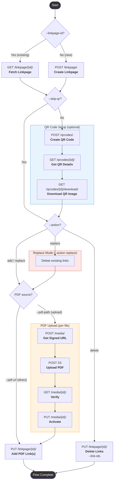

# uniqode-pdf-flow

Automates the end-to-end flow of creating a Linkpage, generating a QR code, uploading a PDF, and attaching it to the Linkpage — all via the Uniqode API. Supports customizable workflows: use existing linkpages, provide direct PDF URLs, and add/replace/delete multiple links.

---

## API Flow Diagram


```mermaid
flowchart TD
    Start([Start]) --> CheckLP

    CheckLP{"--linkpage-id?"}
    CheckLP -- "Yes (existing)" --> S1_GET["GET /linkpage/{id}/<br/><b>Fetch Linkpage</b>"]
    CheckLP -- "No (new)" --> S1_POST["POST /linkpage/<br/><b>Create Linkpage</b>"]
    S1_GET --> CheckQR
    S1_POST --> CheckQR

    CheckQR{"--skip-qr?"}
    CheckQR -- No --> S2
    CheckQR -- Yes --> CheckAction

    subgraph QR ["QR Code Setup (optional)"]
        S2["POST /qrcodes/<br/><b>Create QR Code</b>"] --> S2_1
        S2_1["GET /qrcodes/{id}/<br/><b>Get QR Details</b>"] --> S2_2
        S2_2["GET /qrcodes/{id}/download/<br/><b>Download QR Image</b>"]
    end

    S2_2 --> CheckAction

    CheckAction{"--action?"}
    CheckAction -- "delete" --> S6
    CheckAction -- "add / replace" --> CheckPDF

    CheckPDF{"PDF source?"}
    CheckPDF -- "--pdf-path (upload)" --> UPLOAD
    CheckPDF -- "--pdf-url (direct)" --> S5

    subgraph UPLOAD ["PDF Upload (per file)"]
        S3["POST /media/<br/><b>Get Signed URL</b>"] --> S4
        S4["POST S3<br/><b>Upload PDF</b>"] --> S4_1
        S4_1["GET /media/{id}/<br/><b>Verify</b>"] --> S4_2
        S4_2["PUT /media/{id}/<br/><b>Activate</b>"]
    end

    S4_2 --> S5

    subgraph REPLACE ["Replace Mode (--action replace)"]
        DEL_OLD["Delete existing links"]
    end

    CheckAction -- "replace" --> DEL_OLD --> CheckPDF

    S5["PUT /linkpage/{id}/<br/><b>Add PDF Link(s)</b>"] --> End([Flow Complete])

    S6["PUT /linkpage/{id}/<br/><b>Delete Links</b><br/>--link-ids"] --> End

    style QR fill:#e8f4fd,stroke:#4a90d9
    style UPLOAD fill:#fef3e0,stroke:#f5a623
    style REPLACE fill:#fde8e8,stroke:#d94a4a
    style Start fill:#333,color:#fff
    style End fill:#333,color:#fff
```

### Text Diagram (for non-Mermaid viewers)

```
                        ┌─────────────┐
                        │    Start    │
                        └──────┬──────┘
                               │
                    ┌──────────┴──────────┐
                    │   --linkpage-id?    │
                    ├── Yes ──────────────┼── No ──────────────┐
                    ▼                     │                     ▼
          GET /linkpage/{id}/             │          POST /linkpage/
          (use existing)                  │          (create new)
                    │                     │                     │
                    └─────────┬───────────┘─────────────────────┘
                              │
                    ┌─────────┴──────────┐
                    │    --skip-qr?      │
                    ├── No ──────────────┼── Yes ──────┐
                    ▼                    │              │
          ┌─── QR Setup ──────────┐     │              │
          │ POST /qrcodes/        │     │              │
          │ GET  /qrcodes/{id}/   │     │              │
          │ GET  .../download/    │     │              │
          └──────────┬────────────┘     │              │
                     └──────────────────┘──────────────┘
                              │
                    ┌─────────┴──────────┐
                    │    --action?       │
                    ├── delete ──────────┼── add / replace ────┐
                    ▼                    │                      │
          PUT /linkpage/{id}/            │                      ▼
          (deleted_links)                │          ┌── PDF source? ──┐
                    │                    │          │                  │
                    │                    │  --pdf-path         --pdf-url
                    │                    │  (upload to S3)     (use directly)
                    │                    │     │                    │
                    │                    │     ▼                    │
                    │                    │  POST /media/            │
                    │                    │  POST S3                 │
                    │                    │  GET /media/{id}/        │
                    │                    │  PUT /media/{id}/        │
                    │                    │     │                    │
                    │                    │     └────────┬───────────┘
                    │                    │              ▼
                    │                    │  PUT /linkpage/{id}/
                    │                    │  (add PDF links)
                    └────────────────────┘──────────────┘
                              │
                        ┌─────┴─────┐
                        │   Done    │
                        └───────────┘
```

---

## Prerequisites

- **Python 3.8+** installed on your machine
- **pip** (Python package manager)

Install the required dependency:

```bash
pip install requests
```

---

## Getting Your API Credentials

You need two values from the Uniqode dashboard: your **API Key** and **Organization ID**.

1. Log in to the Uniqode dashboard:
   - **Production:** https://dashboard.uniqode.com
   - **QA/Staging:** https://dashboardqa.uniqode.com

2. Navigate to **Developer > API** from the left sidebar.

3. On the API page you will find:

   | Field              | Description                          |
   |--------------------|--------------------------------------|
   | **YOUR API KEY**   | Click the copy icon to copy it       |
   | **ORGANIZATION ID**| Your numeric org ID (e.g. `949`)     |

   > Keep your API key confidential. Do not share it publicly.

---

## Quick Start

### Full flow (create everything from scratch)

```bash
python linkpage_pdf_flow.py \
    --token "YOUR_API_KEY" \
    --org-id YOUR_ORG_ID \
    --env prod \
    --pdf-path /path/to/your-file.pdf \
    --linkpage-name "My Linkpage" \
    --qr-name "My QR Code"
```

### Use a direct PDF URL (skip upload)

```bash
python linkpage_pdf_flow.py \
    --token "YOUR_API_KEY" \
    --org-id YOUR_ORG_ID \
    --env prod \
    --linkpage-id 56055 --skip-qr \
    --pdf-url "https://eddy.pro/pdf/443643"
```

### Upload multiple PDFs at once

```bash
python linkpage_pdf_flow.py \
    --token "YOUR_API_KEY" \
    --org-id YOUR_ORG_ID \
    --pdf-path file1.pdf file2.pdf file3.pdf
```

### Replace all links on an existing linkpage

```bash
python linkpage_pdf_flow.py \
    --token "YOUR_API_KEY" \
    --org-id YOUR_ORG_ID \
    --linkpage-id 56055 --skip-qr \
    --pdf-url "https://eddy.pro/pdf/443643" \
    --action replace
```

### Replace a specific link (swap one link for another)

```bash
python linkpage_pdf_flow.py \
    --token "YOUR_API_KEY" \
    --org-id YOUR_ORG_ID \
    --linkpage-id 56055 --skip-qr \
    --action replace-link --link-ids 265965 \
    --pdf-url "https://eddy.pro/pdf/NEW_ID" \
    --pdf-name "Updated Brochure"
```

### Delete specific links

```bash
python linkpage_pdf_flow.py \
    --token "YOUR_API_KEY" \
    --org-id YOUR_ORG_ID \
    --linkpage-id 56055 --skip-qr \
    --action delete --link-ids 265965 265966
```

### Using environment variables

```bash
export UNIQODE_TOKEN="YOUR_API_KEY"
export UNIQODE_ORG_ID="YOUR_ORG_ID"
export UNIQODE_ENV="prod"   # or "qa" (default)

python linkpage_pdf_flow.py --pdf-path /path/to/your-file.pdf
```

> The `--env` flag (or `UNIQODE_ENV`) automatically configures all URLs:
>
> | `--env` | API Base URL | PDF Base URL |
> |---|---|---|
> | **`prod`** | `https://api.uniqode.com/api/2.0` | `https://eddy.pro` |
> | **`qa`** *(default)* | `https://beaconstacqa.mobstac.com/api/2.0` | `https://q.eddy.pro` |

---

## Workflow Modes

The script supports three link operations via `--action`:

| Action           | What It Does                                                                     |
|------------------|----------------------------------------------------------------------------------|
| **`add`**        | *(default)* Add new PDF link(s) to the linkpage, keeping any existing links      |
| **`replace`**    | Remove **all** existing links, then add the new PDF link(s)                      |
| **`replace-link`** | Remove **specific** link(s) by `--link-ids`, then add new PDF link(s)          |
| **`delete`**     | Remove specific links by ID (use `--link-ids`). No PDF source needed.            |

### Skippable Steps

| Flag             | What It Skips                                                      |
|------------------|--------------------------------------------------------------------|
| `--linkpage-id`  | Skips linkpage creation — uses an existing linkpage by ID          |
| `--skip-qr`     | Skips QR code creation (Steps 2, 2.1, 2.2)                        |
| `--pdf-url`      | Skips PDF upload (Steps 3, 4, 4.1, 4.2) — uses the URL directly  |

---

## What the Script Does

The script executes these steps in sequence, automatically chaining outputs from each step into the next. Steps are skipped based on your flags:

| Step   | Action                          | Skipped When                              |
|--------|---------------------------------|-------------------------------------------|
| **1**  | Create / Fetch Linkpage         | `--linkpage-id` → fetches instead of creating |
| **2**  | Create QR Code                  | `--skip-qr`                               |
| **2.1**| Get QR Details                  | `--skip-qr`                               |
| **2.2**| Download QR Image               | `--skip-qr`                               |
| **3**  | Get Signed Upload URL           | `--pdf-url` (no upload needed)            |
| **4**  | Upload PDF to S3                | `--pdf-url`                               |
| **4.1**| Verify Media                    | `--pdf-url`                               |
| **4.2**| Activate Media                  | `--pdf-url`                               |
| **5**  | Attach PDF link(s) to Linkpage  | `--action delete`                         |
| **6**  | Delete links from Linkpage      | Only runs with `--action delete`          |

---

## CLI Reference

| Argument             | Required | Default                       | Description                                              |
|----------------------|----------|-------------------------------|----------------------------------------------------------|
| `--token`            | Yes*     | `UNIQODE_TOKEN` env var       | Your API key from the dashboard                          |
| `--org-id`           | Yes*     | `UNIQODE_ORG_ID` env var      | Your Organization ID from the dashboard                  |
| `--env`              | No       | `UNIQODE_ENV` or `qa`         | Target environment: `qa` or `prod`                       |
| `--pdf-path`         | **       | —                             | Path(s) to PDF file(s) to upload. Accepts multiple.      |
| `--pdf-url`          | **       | —                             | Direct PDF URL(s) — skip upload. Accepts multiple.       |
| `--pdf-name`         | No       | `PDF 1`, `PDF 2`, ...         | Display name(s) for `--pdf-url` entries (same order)     |
| `--linkpage-id`      | No       | —                             | Use an existing linkpage (skip creation)                 |
| `--linkpage-name`    | No       | `Hersheys TLC 101`            | Name for a new linkpage                                  |
| `--qr-name`          | No       | `QR: Hersheys 10001`          | Name for the new QR code                                 |
| `--skip-qr`          | No       | Off                           | Skip QR code creation steps                              |
| `--action`           | No       | `add`                         | `add`, `replace`, `replace-link`, or `delete`            |
| `--link-ids`         | ***      | —                             | Link ID(s) for `--action delete` or `replace-link`       |
| `--media-folder`     | No       | Auto-assigned by API          | Media folder ID for organizing uploads                   |
| `--output-dir`       | No       | Current directory              | Directory to save the downloaded QR image                |
| `--verbose`          | No       | Off                           | Show detailed debug output                               |

\* Can be provided via environment variable instead.
\*\* At least one `--pdf-path` or `--pdf-url` required for `add`/`replace` actions.
\*\*\* Required when `--action delete` or `--action replace-link`.

---

## Environment Variables

```bash
export UNIQODE_TOKEN="your-api-key-here"
export UNIQODE_ORG_ID="949"
export UNIQODE_ENV="prod"   # or "qa" (default)
```

CLI arguments take precedence over environment variables.

---

## Example Output

### Full flow (upload + attach)

```
17:35:30  INFO  Environment : prod
17:35:30  INFO  API base URL: https://api.uniqode.com/api/2.0
17:35:30  INFO  STEP 1 — Create Linkpage: My Linkpage
17:35:32  INFO  STEP [1-create-linkpage] ✓  201
17:35:32  INFO    Linkpage ID  : 56055
17:35:32  INFO    Linkpage URL : https://linkpages.pro/QksOIY
17:35:34  INFO  STEP [2-create-qr] ✓  201
17:35:34  INFO    QR Code ID : 1846879
17:35:35  INFO  STEP [2.1-get-qr-details] ✓  200
17:35:40  INFO  STEP [2.2-download-qr-image] ✓  200
17:35:40  INFO    Saved QR image → ./qr_1846879.pdf
17:35:41  INFO  UPLOADING PDF 1/1: sample.pdf
17:35:41  INFO  STEP [3-get-signed-url] ✓  201
17:35:42  INFO    Upload ✓  Status: 204
17:35:43  INFO  STEP [4.1-verify-media] ✓  200
17:35:45  INFO  STEP [4.2-activate-media] ✓  200
17:35:47  INFO  STEP 5 — Add 1 PDF link(s) to Linkpage 56055
17:35:47  INFO  STEP [5-add-pdf-to-linkpage] ✓  200
17:35:47  INFO    Links count : 1
17:35:47  INFO  ✅  FLOW COMPLETE
17:35:47  INFO    Linkpage ID   : 56055
17:35:47  INFO    Linkpage URL  : https://linkpages.pro/QksOIY
17:35:47  INFO    PDF URL       : https://eddy.pro/pdf/443643
```

### Direct URL + existing linkpage

```
17:40:00  INFO  STEP 1 — Get existing Linkpage: 56055
17:40:01  INFO  STEP [1-get-linkpage] ✓  200
17:40:01  INFO    Existing links: 1
17:40:01  INFO  SKIPPING QR Code steps (--skip-qr)
17:40:01  INFO  USING DIRECT PDF URL 1/1: https://eddy.pro/pdf/443643
17:40:02  INFO  STEP 5 — Add 1 PDF link(s) to Linkpage 56055
17:40:02  INFO  STEP [5-add-pdf-to-linkpage] ✓  200
17:40:02  INFO    Links count : 2
17:40:02  INFO  ✅  FLOW COMPLETE
```

The script also saves a `flow_results.json` file with the full API responses from each step.

---

## Output Files

| File                    | Description                                            |
|-------------------------|--------------------------------------------------------|
| `qr_<id>.pdf`          | The downloaded QR code image (PDF format)              |
| `flow_results.json`    | Full JSON dump of all API responses for debugging      |

---

## Troubleshooting

| Issue                            | Solution                                                                  |
|----------------------------------|---------------------------------------------------------------------------|
| `--token is required`            | Provide your API key via `--token` or set `UNIQODE_TOKEN` env var         |
| `requires --pdf-path or --pdf-url` | Provide at least one PDF source for add/replace actions                 |
| `requires --link-ids`            | Provide link IDs to delete with `--action delete --link-ids 123 456`      |
| `403 Access Denied` on S3 upload | Signed URL may have expired — re-run the script to get a fresh one        |
| `401 Unauthorized`               | Check that your API key is correct and has not been regenerated            |
| `PDF file not found`             | Verify the `--pdf-path` points to an existing file                        |
| Connection errors                | Check that the `--env` setting matches your target environment            |

For detailed debug output, add the `--verbose` flag to your command.
